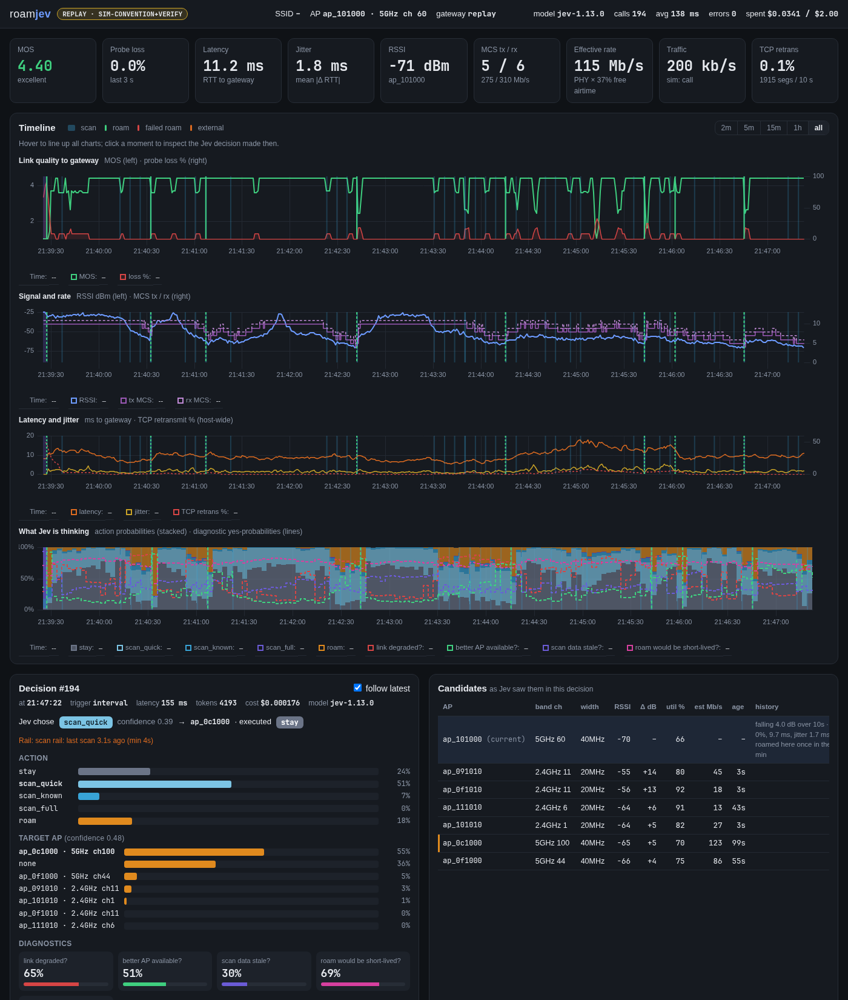

# roamjev
roamjev is a Linux utility that hands every Wi-Fi roaming and scanning decision to [Jev](https://docs.typesafe.ai), TypeSafe AI's decision model. It is built on [roamctl](https://github.com/jwil007/roamctl) and, like roamctl, works exclusively through the wpa_supplicant control interface, so the rest of your network stack stays as-is.

roamctl decides with tiers, score weights and hysteresis that you tune. roamjev describes the situation to Jev instead: link quality to the gateway, signal and rates, what the client is doing, how busy the APs are, what each action costs, and what happened after its own recent roams. Jev decides when to scan, how widely, whether to roam, and where. Code measures, describes, executes, and keeps a journal of every decision.

> [!WARNING]
> This is an experiment. It needs a TypeSafe API key (Jev is in early access), and every decision is a cloud call. If Jev can't be reached (error, timeout, or spend cap reached), roamctl's algorithm decides until it can.




## Quick Start

### One-line install
Downloads and verifies the latest Linux binary for AMD64, ARM64, or ARM32, asks for your TypeSafe API key, and optionally sets up a systemd service.
```
curl -fsSL https://raw.githubusercontent.com/jwil007/roamjev/main/install.sh -o /tmp/install.sh && bash /tmp/install.sh
```
The installer checks your key against the API and saves it to `/etc/roamjev/api_key` (readable by root only). The binary goes to `/usr/local/bin/roamjev`.

Run it in the foreground:
```
sudo roamjev -iface <iface>
```
The dashboard URL is printed as a clickable link. Ctrl+click it to open `http://127.0.0.1:8077`.

Try it without touching your radio. The simulator still makes real Jev calls:
```
roamjev -sim -sim-scenario convention
```

### Build from source
<details>
  <summary>Click to expand</summary>

Requires Go 1.25 or newer.
```
go install github.com/jwil007/roamjev/cmd/roamjev@latest
```
Put your key in `/etc/roamjev/api_key`, or pass it with `-key <file>` or the `TYPESAFE_API_KEY` environment variable.
</details>

> [!NOTE]
> roamjev and roamctl can't both control roaming on the same interface. Stop roamctl first (`sudo systemctl stop roamctl@<iface>`). The one exception is `-observe`, which changes nothing and can run alongside roamctl.


## How it works
Every 3 seconds, and right after every scan, roamjev:

1. **Observes** the link: RSSI, MCS and PHY rate from nl80211; loss, latency and jitter to the gateway from ARP probes; interface traffic; scan results; and the AP's 802.11k neighbor list when it provides one.
2. **Describes** it to Jev as plain measurements with the arithmetic already done ("+15 dB vs current", "about 1.2x the current link", "falling 12 dB over 10s"), plus a briefing of Wi-Fi facts: how bands differ, that airtime is shared, what scans and roams cost, and that switching back and forth is churn.
3. **Asks** Jev, in one call, what to do (stay, refresh two known channels, refresh all known channels, discover new APs with a full scan, or roam), where to roam, how urgent it is, and four yes/no diagnostics.
4. **Acts** on Jev's top choice. Before a roam it re-measures the target's channel and re-asks Jev if the target moved 6 dB or more.

Every scan option is described with its measured cost: how long the last one took and what it did to gateway loss and latency (typical and peak).

Code never applies a threshold to when or where to roam. Around Jev there are rails, one discovery rule, and a fallback:

- **Rails:** a 5s gap between roams, a 4s gap between scans, a valid target, and a spend cap.
- **Safety net:** if the link is degraded (RSSI at or below -75 dBm, or 10%+ gateway loss), no AP measured in the last 30s is 6 dB stronger, and the last full scan is 30s+ old, roamjev runs a full scan even if Jev didn't ask for one. Jev is good at choosing among APs it has measured, but it doesn't reason about APs it has never heard. In a long corridor that is exactly what's needed. Disable with `-safety-net=false`.
- **Fallback:** roamctl's algorithm decides if and only if Jev is unreachable.

> [!NOTE]
> When roamjev is running, it disables wpa_supplicant's autonomous roaming (bgscan and BTM). The original configuration is restored when it exits.

### Dashboard
`http://127.0.0.1:8077`, bound to localhost.

- Live link quality, RSSI, MCS, effective rate, and traffic
- Four synced timelines, including Jev's action probabilities over time, with scans and roams marked
- Click any moment to see the exact state Jev was sent and every probability it returned
- Candidate APs as Jev saw them, a scorecard, and roam outcomes

Every run is also written to a JSON-lines journal (`/var/lib/roamjev/` as root, otherwise `~/.local/state/roamjev/`).


## Results so far
roamjev was compared against roamctl's algorithm (ported as `-policy classic`, using roamctl's own scoring and default config) in five simulated environments, with 10 paired runs per environment where both arms see the identical simulated world. These are results on held-out seeds that were never used for tuning:

| Jev vs classic | Office | Convention | Hospital | Hallway | Corridor |
|---|---|---|---|---|---|
| Avg MOS on calls | even | **+0.08** | even | +0.02 | +0.08 |
| Time with good call quality | even | **81% vs 74%** | 78% vs 76% | 95% vs 92% | 73% vs 75% |
| Time disconnected | 0 vs 0 | 0 vs 0 | **0.06% vs 0.19%** | 0 vs 0 | **0 vs 0.25%** |
| Time scanning | 23s vs 17s | **37s vs 88s** | 65s vs 75s | even | 123s vs 69s |
| Effective rate | −67 Mb/s | +10 Mb/s | −14 Mb/s | **−309 Mb/s** | −57 Mb/s |

Overall Jev is about even with classic.

- **Convention center:** clearly better. Better calls in 10 of 10 runs, with less than half the scanning.
- **Disconnects:** Jev never lost the connection in any run. Classic did in the hospital and corridor.
- **Weak spots:**
  - lower throughput in the hallway, where it gives up 6 GHz more readily;
  - the occasional ping-pong;
  - more roams than classic in the office.

Jev chooses well among APs it has measured. It does not decide on its own to search for APs it has never heard, which is why the safety net exists. In the corridor, the safety net ran about 4 full scans per run. All rounds, including what didn't work, are in [docs/iterations.md](docs/iterations.md).

> [!IMPORTANT]
> These are simulator results. The simulator models propagation, load, scans (dwell plus returns to the home channel, measured on real hardware), and roam time by security type, but it is not a real network. An earlier version of the simulator charged far too much for scanning, which flattered Jev (it scans less than classic). These numbers use the corrected model.


## Usage

### Daemon mode
The installer can set this up. To do it by hand, copy `systemd/roamjev@.service` to `/etc/systemd/system/`, then run `sudo systemctl daemon-reload`.

Start the service:
```
sudo systemctl start roamjev@<iface>
```
View logs:
```
journalctl -u roamjev@<iface> -f
```
Enable at boot:
```
sudo systemctl enable roamjev@<iface>
```

### Foreground mode
Connect to an SSID, then run `sudo roamjev -iface <iface>`. Exit with `ctrl+c`.

### Observe mode
`sudo roamjev -iface <iface> -observe` asks Jev on every cycle but executes nothing and leaves wpa_supplicant's settings alone. It can run alongside roamctl, whose roams show up in the log as external.

### Simulator and comparisons
```
roamjev -sim -sim-scenario hospital                     # simulated environment, real Jev calls
roamjev -sim -sim-scenario hospital -policy classic     # roamctl's algorithm in the same world
roamjev -sim -sim-seed 7 ...                            # same seed = identical world for both arms
roamjev -compare ~/.local/state/roamjev/*.jsonl         # paired comparison of runs
roamjev -summary <journal.jsonl>                        # scorecard for one run
roamjev -replay <journal.jsonl>                         # dashboard for a recorded run
```
Scenarios: `office`, `convention`, `hospital`, `hallway`, `corridor` (320 m, no 802.11k: only a full scan finds the APs ahead), `boundary`.

### Flags
Run with `sudo roamjev -<ARG> <value>`.

`-iface`: Wireless interface. Default is `wlan0`.

`-observe`: Ask Jev but execute nothing.

`-listen`: Dashboard address. Default is `127.0.0.1:8077`.

`-budget`: Pause Jev calls after this many USD in one run. Default is `2`. Use `0` for no limit (recommended for a long-running service).

`-interval`: Time between decisions. Default is `3s`.

`-verify-roam`: Re-measure the target's channel before each roam. Default is on.

`-safety-net`: Run a full scan when the link is degraded and no recently measured AP is clearly stronger. Default is on.

`-min-confidence`: Only roam when Jev's action confidence is at least this. Default is `0` (act on Jev's top choice).

`-key`: API key file. Default lookup is `$TYPESAFE_API_KEY`, then `/etc/roamjev/api_key`.

`-model`: Jev model ID. Default is `jev-1.13.0`.

`-allow-btm`: Leave 802.11v BTM enabled, which lets APs steer the client.

`-probe-test`: Run only the gateway ARP probe for 10s and print loss, latency, jitter and MOS.

`-neighbor-test`: Ask the current AP for its 802.11k neighbor list and print the raw result.

`-level`: Log level, `info` or `debug`.

Run `roamjev -h` for the simulator and comparison flags.

### Uninstall
This one line command removes the binary, key, journals, and service configuration.
```
UNITS=$(systemctl list-units 'roamjev@*' --no-legend | awk '{print $1}'); [ -n "$UNITS" ] && sudo systemctl stop $UNITS && sudo systemctl disable $UNITS; sudo rm -f /etc/systemd/system/roamjev@.service; sudo systemctl daemon-reload; sudo rm -rf /etc/roamjev /var/lib/roamjev /usr/local/share/roamjev /usr/local/bin/roamjev
```


## Cost
Jev costs $0.042 per million input tokens and output is free ([TypeSafe models](https://docs.typesafe.ai/models.md)). A decision is about 3,000-4,500 tokens, roughly $0.0001-0.0002, so continuous use costs about $2-4 per day. The default `-budget` pauses Jev after $2 in a single run.


## Notes
- **Gateway probing:** roamjev sends ARP requests to the gateway 4 times a second to measure loss, latency and jitter (every IPv4 gateway answers ARP, unlike ICMP). That is about 0.16% of airtime per client, which is negligible for one machine but adds up if many clients share a channel, and it keeps the radio out of power save.
- **802.11k neighbor reports:** vendor support is mixed. Some APs advertise 802.11k but don't answer requests, and lists can be incomplete. roamjev treats the list as a hint.
- **wpa_supplicant 6 GHz support:** as with roamctl, wpa_supplicant v2.10 (common on Debian-based distros) may not reliably find 6 GHz APs. v2.11 or newer is recommended for 6 GHz.
